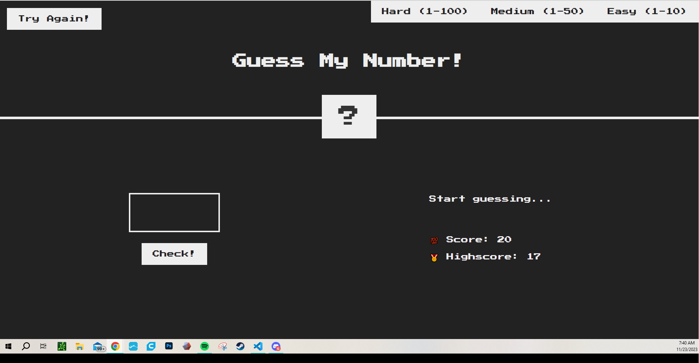

# Guess My Number Game

Welcome to the Guess My Number game! This is a simple guessing game where you try to guess the number chosen by the computer.

## How to Play

1. **Difficulty Settings:** 
   - Choose your preferred difficulty setting before starting the game.
   - Difficulty settings may include Easy(1-20), Medium (1-50), and Hard(1-1000).

2. **Gameplay:**
   - Once the difficulty is selected, the computer will pick a random number within the specified range.
   - You'll be prompted to guess the number chosen by the computer.
   - Enter your guess.
   - Based on your guess, the game will provide hints such as "Too high" or "Too low" to help you narrow down the number.

3. **Winning the Game:**
   - Keep guessing until you correctly guess the computer's number and the phrase "🎉 Correct Number!" is displayed.
   - You win the game when your guess matches the computer's chosen number and the .

4. **Have Fun:**
   - Enjoy playing and challenge yourself to guess the number within the fewest attempts possible!

## Technologies Used

This game was created using [HTML, CSS, and JavaScript].

## Getting Started

To run the game:
- Clone this repository to your local machine.
- Open the game file in your preferred [IDE or text editor].
- Run the game and start guessing!

Feel free to tweak or enhance the game and share your feedback. Enjoy!
